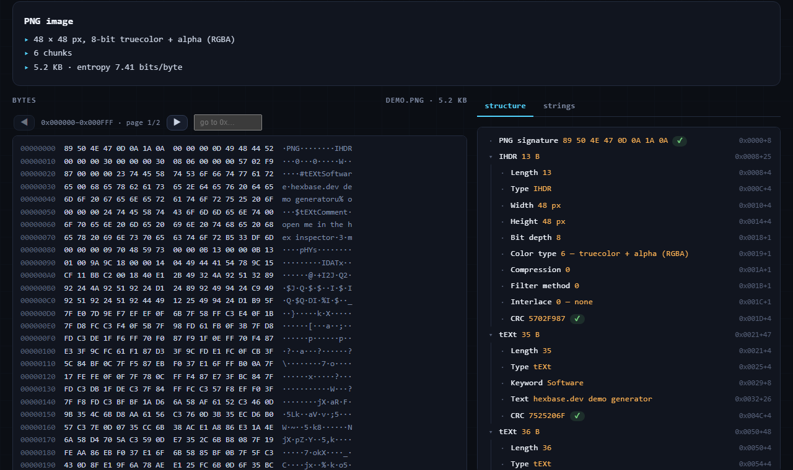

# hexbase.dev

[](https://github.com/davidapp/hexbase.dev/actions/workflows/ci.yml?query=branch%3Amain)
[](LICENSE)
[](https://hexbase.dev)

**Inspect the bytes.** Developer tools that show you what your data is actually made of — and teach you the formats while they're at it. Local-first processing: files, tokens, packet captures and certificates never leave the browser unless you explicitly click *Share*.

**→ [hexbase.dev](https://hexbase.dev)** — free, no accounts, works offline once visited.

[](https://hexbase.dev/tools/hex/?demo=png)

Contributions welcome — see [CONTRIBUTING.md](CONTRIBUTING.md); the `good first issue` label lists formats the inspector can identify but not yet walk.

## Tools

| Tool | Path | What it does |
| --- | --- | --- |
| Hex Inspector | `/tools/hex/` | Drop any file: hex view, magic-byte identification, structural parsing of PNG, JPEG, GIF, ZIP, gzip, ELF, PE, Mach-O, Java class, SQLite, MP4, RIFF/WAV, BMP, PDF, WASM, tar, and the macOS family — binary plist (full object graph), DMG (koly trailer), AppleSingle/AppleDouble, xar (.pkg/.xip), icns (+19 detect-only magics incl. BOM and dyld cache); strings extraction, entropy |
| Packet Decoder | `/tools/packet/` | Paste a hex dump (raw, xxd, hexdump -C, Wireshark) **or open a .pcap/.pcapng file** (frame list, per-frame decode; Ethernet, loopback, raw-IP and Linux SLL link types) → Ethernet/VLAN, ARP, IPv4/IPv6, TCP (with options), UDP, ICMP/ICMPv6, DNS (name decompression), TLS (SNI/ALPN), HTTP, NTP. Verifies IPv4/TCP/UDP/ICMP checksums. 7 built-in sample packets, generated with correct checksums |
| JSON Toolkit | `/tools/json/` | Format / minify / sort keys, validation with exact line:column and human explanations, tree view with path copy, stats, JSON → TypeScript interfaces |
| XML Toolkit | `/tools/xml/` | Pretty-print / minify, DOMParser validation, XPath tester, entity escape/unescape |
| Timestamp Converter | `/tools/timestamp/` | Unix s/ms/µs/ns, Windows FILETIME, .NET ticks, NTP, Excel serial, HFS+, Cocoa, GPS — both directions, with plausibility ranking, world clock, live "now" |
| Encode / Decode | `/tools/encode/` | Base64 (+URL-safe), URL, HTML entities, hex/binary, Unicode escapes + per-code-point inspector, JWT decode + HS256 verify, MD5/SHA-1/SHA-256/384/512 |
| JSON Diff | `/tools/diff/` | Structural diff (added/removed/changed/type-changed with exact JSONPaths, key order ignored), optional key-based array matching (`$.users[id=42]`), Myers line diff for text mode |
| Certificate Decoder | `/tools/cert/` | PEM/base64/DER in → subject, issuer, validity countdown, key size (RSA/EC/Ed25519), SANs, key usage, SCTs, fingerprints, full ASN.1 tree with byte-level hex highlighting; whole chains (fullchain.pem) with name + key-id linkage; generic DER view for non-certificates |
| Random Generator | `/tools/random/` | CSPRNG hex/binary/decimal strings (1–4096 chars, unbiased via rejection sampling), presets for 128/256-bit keys (32/64 hex), entropy + brute-force-time readout, batch + copy-all |
| File format guides | `/formats/` | 21 generated landing pages (magic bytes, structure tables, quirks, FAQ, demo deep-links) from `scripts/format-content-*.mjs` via `scripts/make-format-pages.mjs`, which also emits `sitemap.xml` |
| Developer Links | `/links/` | Curated portal (D1-backed, KV-cached) of standards, playgrounds, networking/security tools, registries |

Every tool page ends with a `§ Learn` section — short, opinionated lessons on the underlying format.

## Architecture

```
Browser ── static assets (Vite MPA, plain TypeScript, zero runtime deps)
   │                    all tool logic runs client-side, from src/core/
   └── /api/* ── Worker (Hono)
                   ├── GET  /api/links          D1 → KV cache (1 h)
                   ├── POST /api/share          rate-limit (KV) → R2 (content) + D1 (metadata)
                   ├── GET  /api/share/:code    D1 lookup → stream from R2
                   ├── GET  /s/:code            short link → 302 to the right tool
                   └── cron 03:17 daily         purge expired shares (R2 + D1)
```

- **`src/core/`** — pure TypeScript parsing/conversion logic, no DOM. Fully unit-tested: file-format parsers, packet and pcap decoders, ASN.1/X.509, JSON diff, epoch math, encoders. Shared by the site pages.
- **`src/worker/`** — the Hono app. Env types generated by `wrangler types`. Every response through the Worker gets the security headers in `headers.ts` (CSP that is `'self'`-only plus one pinned inline-script hash, HSTS, nosniff, frame-ancestors none).
- **`site/`** — Vite multi-page frontend. Partials are inlined by a 10-line Vite plugin. No framework, no external fonts/CDNs; biggest page is ~23 KB gzipped JS. Structure trees and frame/chain lists are keyboard-accessible (WAI-ARIA tree/listbox patterns, roving tabindex). Legal pages live at `/terms/` and `/privacy/`; contact is `support@hexbase.dev`.
- **SEO/GEO** — every page ships canonical + Open Graph/Twitter meta and JSON-LD (`WebSite`/`Organization` on the home page; `WebApplication` + `BreadcrumbList` + `FAQPage` per tool; `TechArticle` per format guide, with matching visible FAQ sections). `public/` holds `robots.txt`, `sitemap.xml` (generated), `llms.txt` (AI-crawler site overview), per-tool OG cards in `og/` plus `og.png` and the icons — all images rendered from HTML via headless Chrome. `scripts/indexnow.mjs` submits the sitemap's URLs to IndexNow.
- **PWA** — `public/manifest.webmanifest` + `public/sw.js`: network-first HTML, cache-first hashed assets/demos; visited pages work offline. Registered from `initChrome()`.
- **Metrics** — aggregate page views (path + country, nothing else): the Worker's `notFound` fallthrough counts successful HTML documents into a Workers Analytics Engine dataset before serving them, and a 5-minute cron writes a liveness heartbeat into a second one. No client-side analytics script exists. `scripts/daily-digest.mjs` formats those numbers (plus share counts, health and GitHub stats) as a Chinese-language Slack summary.
- **security.txt** — `public/.well-known/security.txt` (RFC 9116), contact `support@hexbase.dev`.
- **`schema.sql`** — D1 schema + seed for the links directory (re-runnable; preserves shares).

## Development

```bash
npm install
npm run db:local       # seed local D1 (links directory)
npm run dev            # vite build + wrangler dev → http://localhost:8787
npm test               # vitest (core logic)
npm run e2e            # Playwright page smoke tests against dist/ (run npm run build first; once: npx playwright install chromium)
npm run typecheck      # both tsconfigs (site/core + worker)
npm run watch          # optional second terminal: rebuild site on change
```

## Share links

`POST /api/share` accepts `{ tool, content (base64), filename? }` up to 256 KB, rate-limited to 30/h per hashed IP (raw IPs are never stored). Content lives in R2, metadata in D1, links expire after 30 days and are purged nightly by the cron trigger.

## License

- **Code** — [MIT](LICENSE). Everything that executes: `src/`, `site/` markup and scripts, the worker, build scripts, tests, demo specimens.
- **Educational content** — the teaching prose is licensed [CC BY-NC-ND 4.0](https://creativecommons.org/licenses/by-nc-nd/4.0/), not MIT. That covers the format guides (the text in `scripts/format-content-*.mjs`), the "§ Learn" and FAQ sections in the pages, and `llms.txt`. In short: quote it with attribution all you like, but don't republish the guides wholesale or sell them.

Security reports: see [SECURITY.md](SECURITY.md) or <https://hexbase.dev/.well-known/security.txt>.
